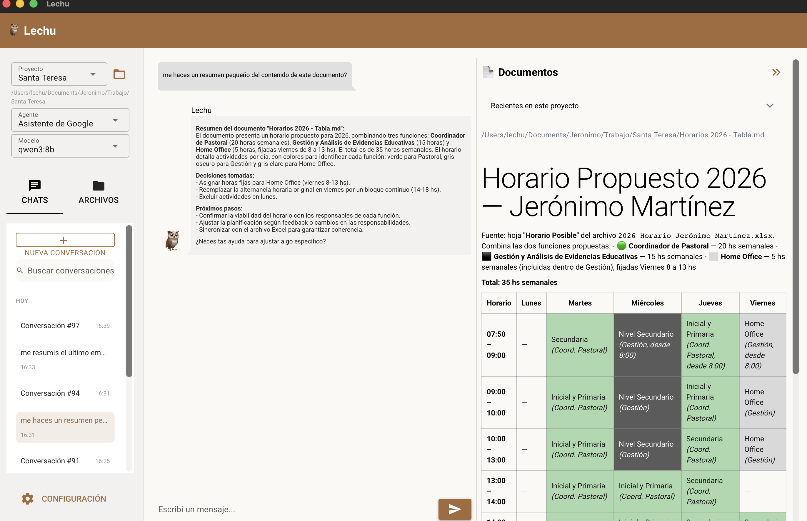

# Lechu 🦉 (Ollama + NiceGUI)

Chatbot local-first: interfaz nativa de escritorio (NiceGUI), inferencia
async con Ollama local, memoria persistente en SQLite, proyectos con carpeta
real + explorer tipo VS Code, agentes con roles/tools específicas y skills
en Markdown para automatizar tareas.



Base (offline): chat + memoria + filesystem + agentes/tools + skills +
proyectos con carpeta real. Conexiones (requieren internet, opcionales -
ver "Conexiones" abajo): Clima, Maps, y Gmail/Drive/Calendar vía OAuth de
Google.

## Abrir la app

**Opción rápida:** doble click en `Lechu.app`. Arranca Ollama si hace falta
y abre una ventana nativa de Mac (NiceGUI en modo `native=True`, sin barra
de navegador ni ventana de Terminal). Podés arrastrarlo a `/Applications` o
al Dock. La primera vez que lo abras, macOS va a avisar que es de un
desarrollador no identificado (Gatekeeper) — hacé click derecho → Abrir
para confirmar una sola vez. Los logs quedan en `data/lechu_launcher.log`.
A diferencia de la versión anterior, cerrar la ventana termina el proceso
del todo (servidor y ventana corren juntos) — la próxima apertura es un
arranque en frío, pero rápido, porque todo es local.

**Setup manual / desarrollo:**

```bash
ollama serve  # si no está corriendo ya
python3 -m venv .venv
source .venv/bin/activate
pip install -r requirements.txt
python3 app.py
```

## Configuración (`config.yaml`)

- `filesystem.whitelisted_folders`: carpetas a las que el chatbot puede leer
  y escribir. Por defecto: `/Users/lechu/ChatbotSandbox`. Agregá más rutas
  absolutas a la lista para habilitarlas.
- `max_tool_iterations`: tope de llamadas a herramientas por turno antes de
  cortar (evita loops infinitos).
- `default_agent`: id del agente que arranca por defecto.

## Agregar un agente

Creá un archivo `agents/mi_agente.yaml`:

```yaml
id: mi_agente
name: "Nombre visible"
model: mistral        # cualquier modelo que tengas en `ollama list`
system_prompt: |
  Instrucciones de rol para este agente.
tools:
  - list_dir
  - read_file
  - write_file
  - delete_file
  - remember_fact
  - recall_facts
```

Se recarga reiniciando la app.

## Agregar una skill

Ver [skills/README.md](skills/README.md). Las skills se recargan en caliente
con el botón "Recargar skills" en la sidebar, sin reiniciar la app.

## Conexiones (Configuración → Conexiones)

Todas son opcionales y requieren internet; sin configurarlas, el resto de
la app sigue siendo 100% offline. Las credenciales nunca se guardan en
archivos del proyecto — van al Keychain de macOS vía `core/secrets.py`.

- **Clima**: [Open-Meteo](https://open-meteo.com), gratis y sin API key,
  no requiere ninguna configuración.
- **Maps**: [OpenRouteService](https://openrouteservice.org), gratis, pedí
  una API key ahí y pegala en Configuración → Conexiones → Maps. Se eligió
  por sobre Google Maps para no depender de una cuenta de billing.
- **Google (Gmail + Drive + Calendar)**: requiere un proyecto propio en
  [Google Cloud Console](https://console.cloud.google.com) con las APIs de
  Gmail/Drive/Calendar habilitadas y una credencial OAuth tipo "App de
  escritorio" (pantalla de consentimiento en modo Testing alcanza para uso
  personal, no hace falta publicar la app). Pegá el Client ID/Secret en
  Configuración → Conexiones → Google y apretá "Conectar con Google" — abre
  el navegador para el login real, el token queda en el Keychain.

## Agregar una tool nueva

Definí la función en `core/tools/`, registrala con `register(Tool(...))`
(ver `core/tools/filesystem.py` como referencia), y agregá su nombre a la
lista `tools:` de los agentes que deban usarla. Si la acción es destructiva
o irreversible, marcá `requires_confirmation=True` para que la UI pida
confirmación antes de ejecutarla.

## Memoria

- `data/memory.db` (SQLite, no versionado) guarda conversaciones, mensajes y
  hechos recordados (`facts`). Se puede inspeccionar y editar a mano desde
  la sidebar ("Memoria") o directamente con `sqlite3 data/memory.db`.
